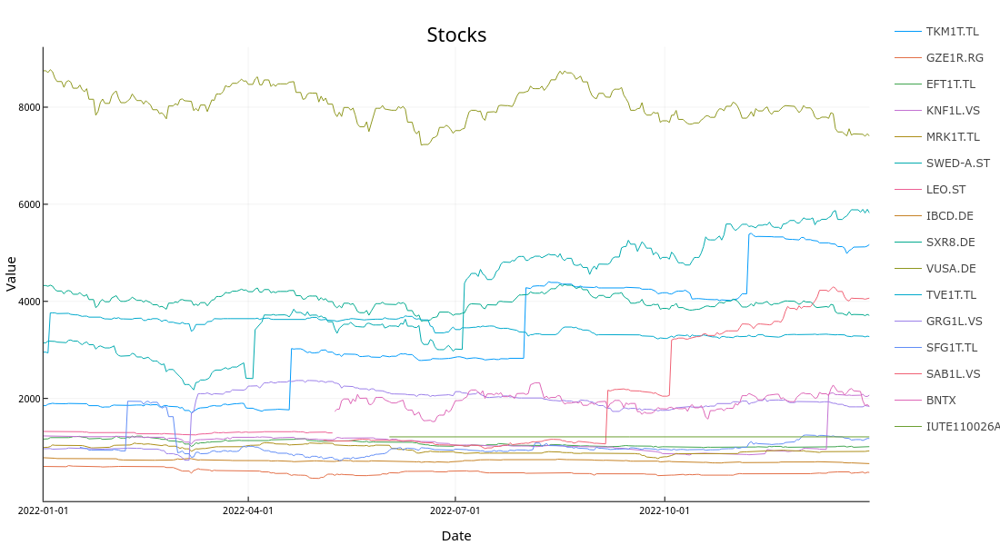
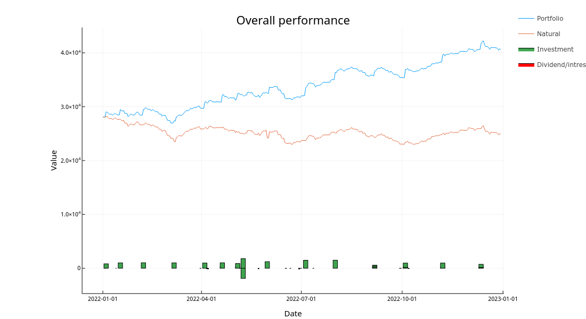
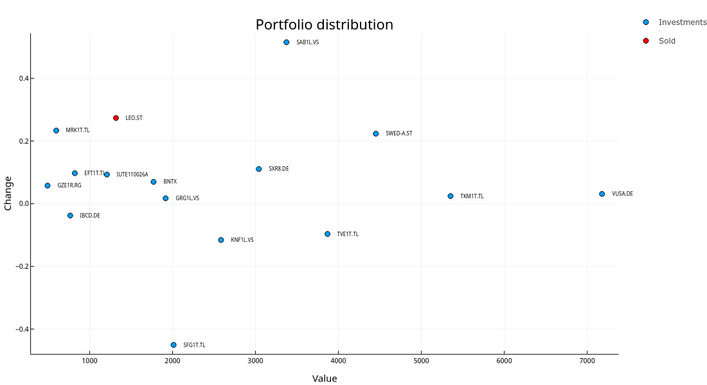

+++
title = "2022 Investment portfolio recap"
summary = "Analysis of portfolio performance in 2022."
template = "page.html"
date = 2023-01-20T15:00:00Z
+++

2022 was definitely more exciting year than usual from the investing perspective.
There had been a huge bull run in 2021 with S&P500 rising 26.89% and everything was screaming to fall looking back at it.
However the decline in 2022 still came as a surprise.
In addition to stocks losing in nominal value we are fighting inflation reaching 21.31% YoY in Estonia and 10.1% in Euroarea.

So without further ado, let's get started with the recap.

# Trades
Throughout the 2022 I tried to buy individual stocks that could withstand the inflation hopefully better than S$P500 as I was expecting it to fall.
Another motivation for it was that I wanted to have higher dividend yield than ~2%.
I also considered some other indexes, but usually they had either too high premiums or were banned in EU for regular in investors.
However I decided to buy some LuteCredit bonds in early summer to have also some more stable assets.

Picking individual stocks went south from the start as I managed do bet on Silvano Fashion Group in January and February.
When the Russian Federation launched it's full scale attack on Ukraine it got hit really hard and suffered over 50% drop in stock price.
Despite the bad news I didn't sell and managed to gain some back by the end of the year (still about 40% loss) and managed to also buy some other stocks that performed better.

I also decided to sell for the first time as Leo Vegas got merge offer with 50% premium over it's stock price.
All in all I invested in multiple individual stocks, mainly dividend stocks in Baltics but also in some more risky stocks such as BioNTech.

Performance of each stock I had can be seen in the Figure below.

# Dividends and interests

For the 2022 I had a goal of getting 1000€ passive income.
Well I failed that... but I managed to earn 855€ which isn't that far off considering the fact that I bought quite many dividend stocks after they had already paid the dividends for this year.

I also started giving out small loans on [omaraha.ee](https://omaraha.ee/et/) from beginning of February.
By the end of the year I'm 45€ in profit which is 9% considering my investment.
Definitely below expectations and I'd argue that it's not worth the risk, but I'm keeping the investment to see how it performs in the future and after all I don't want to keep everything in stocks.

# Other investments
#### Crypto
My crypto investments are not doing good as they seem to be only going down.
I'm not planning on selling them any time soon as I've accounted for the risk, but having lost roughly 50% in a year doesn't make me happy.

#### Options
I also bought some VGK calls in January with one year expiry date.
Well, then the war happened and now they are worth pretty much nothing.
Likely will buy again in with couple of hundred I have at my IB account but call options seem quite expensive right now so we'll see...

# Overall performance
Overall I invested ~15,7k eur while the portfolio increased by 12.5k eur so in total the year resulted in a loss of 3.2k eur.
During the year I managed to have dividend yield of 2.5% which is not much, but still slightly more than SP500.

The overall performance as well as money put in and taken out (dividends) can be seen in the Figure below.

# Portfolio distribution
Here is the overview of my portfolio as of 31st December 2022.
From the Figure below we can see that Šiauliu bankas has been quite a money pot for me this year as I managed to start buying it near bottom in the summer.
Also the Leo Vegas turned out to be all right investment in the end as I managed to sell it at ~60% higher price than what it had via takeover.
From the negative side the Silvano Fashion Group definitely stands out as it has dropped roughly 50% since the Ukraine invasion.

# Key indicators
**Profit:** -3.2k €  
**Profit %:** -9.4%  
**Real profit %:** -30.7%  
**Invested:** 15.7k €  
**Dividends:** 855€  
**Dividend yield:** 2.5%  
**Standard deviation:** 3.4%

# Goals
2022 - 45k
2023 - 60k
2024 - 75k
2025 - 95k
