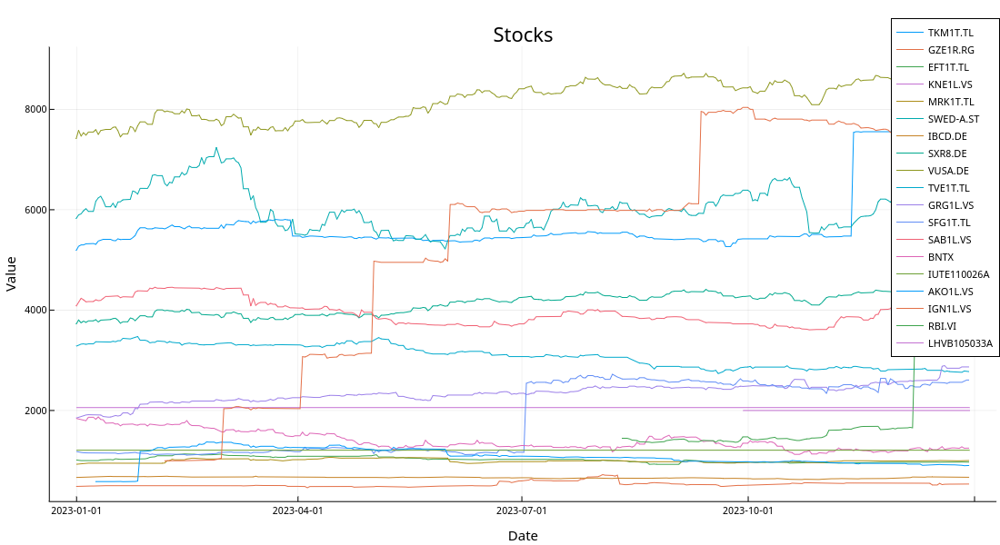
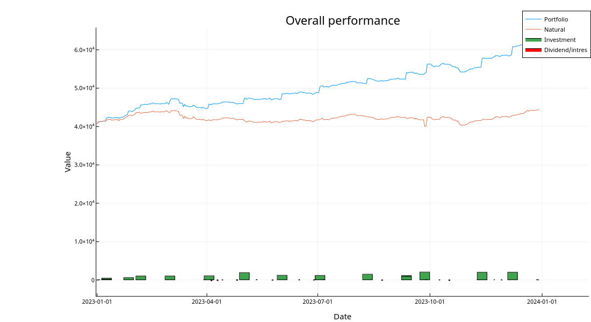
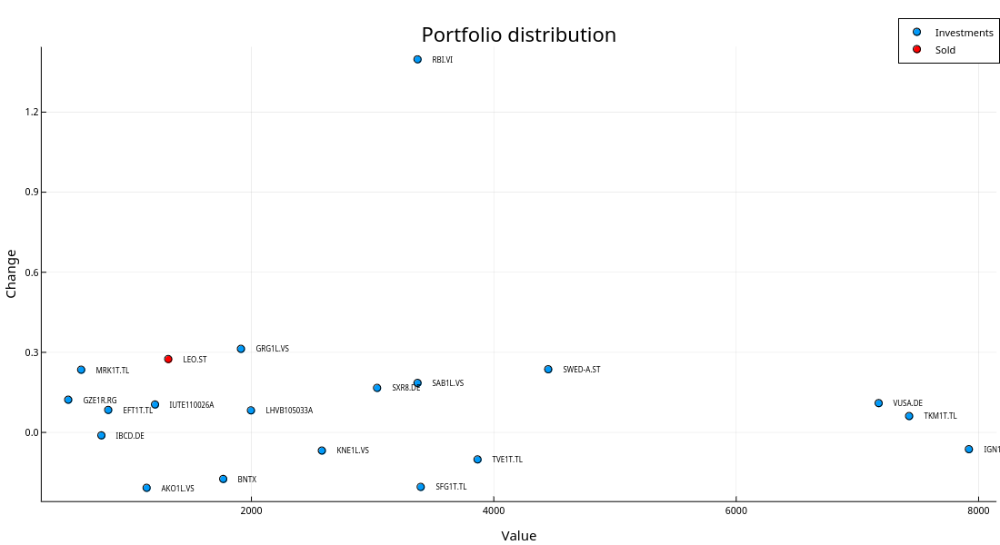

+++
title = "2023 Investment portfolio recap"
summary = "Analysis of portfolio performance in 2023."
template = "page.html"
date = 2024-06-22T15:00:00Z
+++

2023 wasn't as much an andventure as 2022, but a lot was going one nonetheless.
S&P500 started a new bull run by gaining 24.2% again.
Inflation in Estonia seems to be taking a break by falling to 4% - not sure how long that's gonna last tho.

# Trades
Through 2023 I kept picking individual stocks as S&P500 seemed too expensive.
As it keeps going up, it starts to look like a mistake - we'll see.

I also started playing around with the idea of profiting from the war in Ukraine and started purchasing stocks that had huge exposure in Ukraine.
An example of which is RBI, Austrian bank that operates in both Ukraine and Russia.

Other than that I mostly betted on Ignitis grupe and some other stocks I already had.
Towards the end of the year I decided to avoid purchasing Estonian stocks tho due to hikes in the tax rates.

Performance of each stock I had can be seen in the Figure below.

# Dividends and interests

For the 2023 I had a goal of getting 1500€ passive income.
I managed to achieve that by earning whopping 1916€ which is more than double of what I earned last year.

Small loans at [omaraha.ee](https://omaraha.ee/et/) were not doing as great as on last year and I gained only 20€ (3.6%) which is definitely not worth the risk.
As the amount of money there is low I'll keep lending it out just to see how it works out over longer periods of time - no high expectations tho.

# Other investments
#### Crypto
Crypto seems to have recovered from the 50% loss last year - back at around 0 so not too exiting.

#### Options
Didn't do any gambling with options this year, we'll see how lucky I feel in 2024.

# Overall performance
Overall I invested ~17.9k eur while the portfolio increased by 21.6k eur so in total the year resulted in a profit of 3.7k eur.
During the year I managed to have dividend yield of 3.8% which is not much, but still decent.

The overall performance as well as money put in and taken out (dividends) can be seen in the Figure below.

# Portfolio distribution
Here is the overview of my portfolio as of 31st December 2023.
From the Figure below we can see that RBI has been money as even tho I've had it for couple of months I've earned over 20% profit.
That is not sustainable tho, so I guess we'll never see that 130% increase in a year the graph shows.

# Key indicators
**Profit:** 3.7k €  
**Profit %:** 7.4%  
**Real profit %:** 3.4%  
**Invested:** 17.9k €  
**Dividends:** 1916€  
**Dividend yield:** 3.8%  
**Standard deviation:** 1.8%

# Goals
2023 - 60k  
2024 - 80k  
2025 - 100k  
2026 - 125k  
